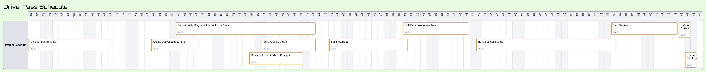

# CS 255 Business Requirements Document

Joshua Sevy

## System Components and Design

### Purpose

The purpose of this project is to plan and document a system for DriverPass to leverage online learning, test practice, and on-road training. DriverPass is an online Learning company that needs a system to help both the company and its customers with scheduling and conducting test drives. The main idea of this project is to ensure students are fully prepared to tackle DMV tests and that the company’s business processes are achieved.

### System Background

DriverPass was created to address a gap in how students prepare for driving license examinations.

Research conducted by DriverPass found that more than 65% of students fail the driving test because their preparation is limited to memorizing previous test examination questions.

This approach does not adequately prepare students for the practical, real-world driving portion of the examination.

DriverPass aims to improve student success by giving a more extensive learning experience which combines online study materials with on-the-road instruction.

The system must also support employees and administrators by providing tools to manage users, scheduling, and operational tasks proficiently.

### Objectives and Goals

Enable customers to create accounts, schedule and manage driving lessons, complete practice exams, and track their learning progress online.

Support multiple user roles, including customers, instructors, administrators, and IT staff, with role-specific access and permissions.

Ensure that instructors and staff can effectively manage lesson schedules, track changes, and monitor student progress.

Allow administrators to generate reports related to student performance, lesson completion, and system usage.

Ensure the system can be easily updated to reflect changes in DMV rules, testing standards, and learning content.

Improve student preparedness for driving exams by offering learning tools that go beyond memorization of past tests.

## Requirements

### Nonfunctional Requirements

### Performance Requirements

The system shall be available to users 24/7, excluding minimal scheduled maintenance periods.

The system shall support simultaneous access by multiple users without performance degradation.

The system shall respond to user actions, such as scheduling lessons or loading practice tests, within an acceptable response time.

The system shall support peak usage periods, such as evenings and weekends, when students are most likely to access the platform.

### Platform Constraints

The system shall be cloud-based to ensure availability, scalability, and remote access.

The system shall be accessible through standard web browsers without requiring specialized software installations.

The system shall support access from multiple device types, including desktops, laptops, tablets, and mobile devices.

The system shall rely on third-party cloud services for hosting, backups, and system maintenance, as described in the interview.

### Accuracy and Precision

The system shall store and display accurate scheduling, lessons, and user account information.

The system shall ensure that changes to schedules, lessons, or user data are reflected consistently across the system.

The system shall prevent any data conflicts when multiple users access or update the same information.

The system shall maintain accurate records of a student’s progress, test results, and lesson completion.

### Adaptability

The system shall be designed to accommodate updates to DMV changes such as rules, testing standards, and training material.

The system shall support adding new features without involving a complete system redesign.

The system shall allow administrators to update learning content and schedules without developer intervention.

The system shall scale to support an increasing number of users as DriverPass grows.

### Security

The system must prompt users to authenticate to use its features.

The system must implement role-oriented access control to restrict system functions by user role.

The system shall protect all protected user data, including personal and payment information.

The system shall leverage reliable third-party cloud providers for its data storage and system security.

The system shall maintain an audit log to record any changes to schedules, lessons, and users.

### Functional Requirements

### User Interface

The system shall provide an accessible user interface that can be accessed over the internet with any standard web browser.

The system shall allow access from multiple devices, which could be desktops, laptops, tablets, and mobile devices.

The system shall offer role-based user interface views for customers, administrators, and IT members.

The system shall allow users to securely log in/out of the system using their unique authentication credentials.

The system shall provide easy-to-use navigation to access practice examinations, lesson scheduling, account information, and administrative functions.

The system shall provide notifications when actions such as scheduling, canceling, or editing lessons are taken.

The system shall enable administrators and IT personnel to access system management and reporting through this interface.

### Assumptions

It is assumed that all users (customers, instructors, administrators, and IT staff) will have dependable internet access and a compatible device to access the DriverPass system.

It is assumed that customers will create and retain accurate personal and payment information securely within the system.

It is assumed that DriverPass will continue to use an external DMV system for providing up-to-date driving test rules and examination content, as discussed in the interview.

It is assumed that instructors will routinely update their availability and lesson status in the system.

It is assumed that DriverPass management will provide timely approval and feedback throughout development to avoid schedule delays.

### Limitations

The system will not guarantee that students pass their driving examinations, as success ultimately rests on individual effort and performance.

The system will be constrained by the availability and accuracy of external DMV data sources, which are outside the DriverPass system's control.

The system will require ongoing maintenance and enhancements, and downtime may occur during scheduled upgrades or unexpected issues.

The system will be limited by internet connectivity and device compatibility, which may affect user access and/or performance.

The system’s functionality and performance may be limited by budget, development timeline, and staffing resources.

### Gantt Chart

